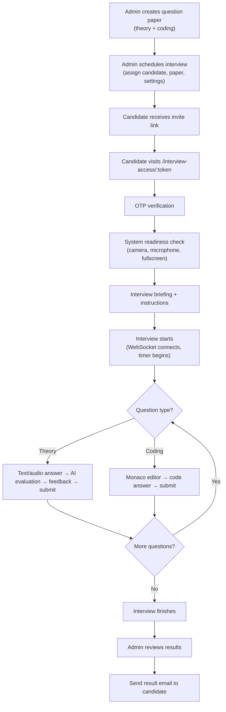

# AI Interview Panel — Project Context

> **Generated**: 2026-05-29 | **Framework**: Next.js 15.3.6 | **Language**: TypeScript 5.x

---

## 1. Project Overview

**AI Interview Panel** is a full-stack AI-powered interview management platform built with **Next.js 15 (App Router)**. It enables organizations to create, schedule, conduct, and evaluate technical interviews with AI-assisted features including:

- **AI-generated question papers** (theory + coding) via Google Gemini
- **Real-time interview proctoring** (tab switching, fullscreen enforcement, face detection via video WebSocket)
- **AI answer evaluation** with instant feedback
- **Speech-to-text / text-to-speech** for audio-based interviews
- **Live admin dashboard** with WebSocket-driven real-time updates
- **Code editor** (Monaco Editor) for coding questions

### User Roles
| Role | Constant | Access |
|------|----------|--------|
| **SUPER_ADMIN** | `USER_ROLES.ADMIN` (3) | Full admin panel, teams, users, all settings |
| **ADMIN** | `USER_ROLES.INTERVIEWER` (2) | Question papers, schedule interviews, view results |
| **CANDIDATE** | `USER_ROLES.CANDIDATE` (1) | Take interviews, view own results |

---

## 2. Tech Stack

| Category | Technology | Version |
|----------|-----------|---------|
| **Framework** | Next.js (App Router) | 15.3.6 |
| **Language** | TypeScript | 5.x |
| **React** | React | 19.x |
| **Styling** | TailwindCSS + CSS Variables | 3.4.x |
| **UI Components** | ShadCN/UI (new-york style) + Lucide Icons | latest |
| **State Management** | Redux Toolkit + react-redux | 2.11.x / 9.2.x |
| **Forms** | react-hook-form | 7.58.x |
| **HTTP Client** | Axios | 1.10.x |
| **WebSockets** | Native WebSocket API (custom hooks) | — |
| **Charts** | ApexCharts + react-apexcharts | 4.7.x |
| **Code Editor** | @monaco-editor/react | 4.7.x |
| **AI** | @google/genai (Gemini) | 1.38.x |
| **Auth** | Cookie-based JWT + jose | — |
| **i18n** | next-intl | 4.3.x |
| **Theming** | next-themes (dark mode) | 0.4.x |
| **Push Notifications** | Firebase Cloud Messaging | 11.9.x |
| **Fonts** | Inter + Outfit (Google Fonts via next/font) | — |
| **Toast** | Sonner | 2.x |
| **Linting** | ESLint 9 + Prettier | — |
| **Git Hooks** | Husky | 9.x |
| **Quality** | SonarQube (Docker) | — |
| **Deployment** | Netlify + Vercel | — |

---

## 3. Directory Structure

```
src/
├── app/                          # Next.js App Router
│   ├── (admin)/                  # Admin route group (authenticated, sidebar layout)
│   │   ├── layout.tsx            # Admin layout (Sidebar, Header, DashboardSocket)
│   │   ├── dashboard/            # Admin dashboard with live stats
│   │   ├── live-interview/       # Real-time interview monitoring
│   │   ├── question-paper/       # Theory & coding paper management
│   │   ├── schedule-interview/   # Interview scheduling + creation
│   │   ├── result/               # Interview results & analytics
│   │   ├── teams/                # Team management (super admin)
│   │   └── users/                # User/candidate management
│   ├── (public)/                 # Public routes (no auth required)
│   │   ├── login/                # Admin login
│   │   ├── candidate-login/      # Candidate OTP login
│   │   ├── register/             # Admin registration
│   │   ├── interview-access/     # Interview link landing
│   │   └── interview-finish/     # Interview completion screen
│   ├── (secured)/                # Auth-required routes (candidate)
│   │   └── interview/            # Candidate interview experience
│   ├── api/                      # Next.js API routes (BFF layer)
│   │   ├── admin/                # Admin API proxies
│   │   ├── auth-action/          # Auth action handlers
│   │   ├── evaluate/             # Answer evaluation proxy
│   │   ├── health/               # Health check
│   │   ├── interview/            # Interview process APIs
│   │   ├── locale/               # Locale switching
│   │   ├── resume/               # Resume processing
│   │   ├── session/              # Session management
│   │   └── tts/                  # Text-to-speech proxy
│   ├── globals.css               # Global styles + CSS variables
│   ├── layout.tsx                # Root layout (providers, fonts)
│   └── not-found.tsx             # 404 page
│
├── api/                          # Server Actions (RSC "use server")
│   ├── auth.ts                   # Login, register, logout, forgot/reset password
│   ├── admin.ts                  # Question papers, interviews, results CRUD
│   ├── interview.ts              # Submit answers, finish, timers, OTP
│   ├── evaluateAnswer.ts         # AI answer evaluation
│   ├── team.ts                   # Team CRUD
│   ├── user.ts                   # User/candidate management
│   ├── resume.ts                 # Resume-based prompt generation
│   └── textToSpeech.ts           # TTS via backend
│
├── components/                   # Atomic Design hierarchy
│   ├── atoms/                    # ~44 base components
│   │   ├── Button/               # Custom button variants
│   │   ├── Card/, CustomCard/    # Card containers
│   │   ├── Input/                # Form inputs
│   │   ├── Select/, AsyncSelect/ # Dropdowns
│   │   ├── Table/                # Data table
│   │   ├── Sidebar/              # Admin navigation sidebar
│   │   ├── Header/               # Admin header with notifications
│   │   ├── CameraAccess/         # Webcam access for proctoring
│   │   ├── CandidateAvatar/      # Candidate image display
│   │   ├── Chart/                # ApexCharts wrapper
│   │   ├── CommandPalette/       # Keyboard shortcut command palette
│   │   ├── Countdown/            # Timer countdown display
│   │   ├── Dictaphone.tsx        # Speech-to-text recording
│   │   ├── FinishingView/        # Interview finishing animation
│   │   ├── InterviewStatusBadge/ # Status pill component
│   │   ├── Loader/               # Loading spinner
│   │   ├── LoadingView/          # Full-screen loading state
│   │   ├── NavigationProgress/   # Route change progress bar
│   │   ├── OfflineBanner/        # Network offline indicator
│   │   ├── Pagination.tsx        # Paginated data navigation
│   │   ├── SearchInput/          # Debounced search
│   │   ├── Skeleton/             # Loading skeleton
│   │   ├── StartOverlay/         # Interview start overlay
│   │   ├── StatCard/             # Dashboard metric card
│   │   ├── StatusBadge/          # Generic status badge
│   │   ├── Switch/               # Toggle switch
│   │   ├── ThemeToggle/          # Light/dark mode toggle
│   │   ├── Tile/                 # Grid tile component
│   │   ├── AdminMonitor/         # Admin monitoring widget
│   │   ├── CustomDateTimePicker  # DateTime picker
│   │   └── CustomSliders/        # Range sliders
│   ├── molecules/                # ~17 composite components
│   │   ├── BriefingScreen/       # Pre-interview briefing
│   │   ├── InstructionsScreen/   # Interview instructions
│   │   ├── SystemReadinessCheck/ # System check before interview
│   │   ├── WaitScreen/           # Waiting room
│   │   ├── QuestionCard/         # Question display
│   │   ├── CodingQuestionCard/   # Coding question display
│   │   ├── CodingQuestionView/   # Code editor + question
│   │   ├── TheoryQuestionView/   # Theory answer + evaluation
│   │   ├── InterviewSidebar/     # In-interview question list
│   │   ├── FullscreenWarning/    # Fullscreen exit warning overlay
│   │   ├── CommonTable/          # Reusable data table
│   │   ├── ConfirmationModal/    # Confirm dialog
│   │   ├── CustomModal/          # Generic modal
│   │   ├── Modal/                # Base modal
│   │   ├── FormBuilder/          # Dynamic form generator
│   │   └── InfiniteScroll/       # Infinite scroll container
│   ├── organisms/                # Page-level feature components
│   │   └── AiPaperGenerator/     # AI question paper generator UI
│   ├── layouts/                  # Layout components
│   │   └── FormLayout/           # Form page layout
│   └── hoc/                      # Higher-order components (empty)
│
├── context/
│   └── InterviewSocketContext.tsx # React Context for interview WebSocket
│
├── hooks/                        # Custom React hooks
│   ├── useInterviewActions.ts    # Answer submission, evaluation, skip logic
│   ├── useInterviewSocket.ts     # Candidate interview WebSocket connection
│   ├── useDashboardSocket.ts     # Admin dashboard WebSocket connection
│   ├── useInterviewProctoring.ts # Tab switch, fullscreen enforcement
│   ├── useProctoringSocket.ts    # Video/face detection WebSocket
│   ├── useGlobalTimer.ts         # Interview-wide countdown timer
│   ├── useQuestionTimer.ts       # Per-question countdown timer
│   ├── useDebounce.ts            # Input debouncing
│   ├── useInfiniteFetch.ts       # Paginated data fetching
│   ├── useFcmToken.ts            # Firebase push notification token
│   ├── useNetworkStatus.ts       # Online/offline detection
│   ├── useStatusPolling.ts       # Status polling fallback
│   └── useTranslatedStrings.ts   # i18n string access
│
├── i18n/
│   ├── config.ts                 # Locale configuration
│   └── request.ts                # i18n request handler
│
├── lib/
│   ├── api-client.ts             # Client-side Axios wrapper with auth
│   └── utils.ts                  # cn() re-export (ShadCN)
│
├── messages/                     # Translation files
│   ├── en.json                   # English
│   ├── es.json                   # Spanish
│   └── fr.json                   # French
│
├── reducer/
│   └── index.ts                  # Root reducer combining all slices
│
├── services/                     # Client-side API service layer
│   ├── interviewApi/             # Interview API calls (client-safe wrappers)
│   │   ├── constants.ts          # Interview service endpoints
│   │   └── index.ts              # Action functions
│   ├── adminApi/                 # Admin API calls
│   │   ├── constants.ts          # Admin service endpoints
│   │   └── index.ts              # Action functions
│   └── authApi/                  # Auth API calls
│       ├── constants.ts          # Auth service endpoints
│       └── index.ts              # Action functions
│
├── shared/                       # Shared utilities & config
│   ├── api.ts                    # API endpoint registry (145 endpoints)
│   ├── constants.ts              # Enums, status codes, role maps
│   ├── types.ts                  # Core TypeScript interfaces
│   ├── types/                    # Additional type files
│   │   ├── api.ts                # API-specific types
│   │   └── chart-config.ts       # Chart configuration types
│   ├── fetcher.ts                # Server-side Axios instance (with cookies)
│   ├── http-errors.ts            # Error detection & handling
│   ├── utils.ts                  # General utilities (cn, date, format, etc.)
│   ├── audioUtils.ts             # TTS playback & audio management
│   ├── interviewUtils.ts         # AI evaluation orchestration
│   ├── routes.ts                 # Route constants (PUBLIC/ADMIN/CANDIDATE)
│   ├── session.ts                # Server-side session (jose JWT)
│   ├── session-client.ts         # Client-side session management
│   ├── locale-client.ts          # Client-side locale management
│   ├── strings.ts                # UI string constants & messages
│   ├── ws-client.ts              # WebSocket utilities (URL builder, reconnect)
│   └── ws-types.ts               # WebSocket event type definitions
│
├── slices/                       # Redux Toolkit slices
│   ├── authSlice.ts              # Auth state (user, token, loading)
│   ├── interviewSlice.ts         # Interview state (session, questions, answers)
│   ├── adminSlice.ts             # Admin state (interviews, papers, live data)
│   └── counterSlice.ts           # Example counter slice
│
├── store/
│   ├── store.ts                  # Redux store configuration
│   └── ReduxProvider.tsx         # Client-side Redux provider
│
├── assets/
│   ├── icons/                    # SVG icon assets
│   ├── img/                      # Image assets
│   └── index.ts                  # Asset re-exports
│
├── firebase.ts                   # Firebase initialization (FCM)
└── middleware.ts                  # Next.js middleware (auth + routing)
```

---

## 4. Architecture & Patterns

### 4.1 Route Groups (Next.js App Router)

The app uses **three route groups** with distinct access levels:

| Group | Layout | Auth Required | Description |
|-------|--------|--------------|-------------|
| `(admin)` | Admin layout (sidebar + header + dashboard socket) | Yes (ADMIN/SUPER_ADMIN) | Full admin panel |
| `(public)` | None (standalone pages) | No | Login, register, interview access |
| `(secured)` | Interview socket context | Yes (CANDIDATE) | Candidate interview experience |

### 4.2 Dual API Architecture

The project uses **two distinct HTTP client layers**:

#### Server Actions Layer (`src/api/` → `src/shared/fetcher.ts`)
- Used in **React Server Components** and **Server Actions** (`"use server"`)
- Reads auth tokens from **`cookies()` (next/headers)** — server-only
- Creates a fresh Axios instance per request with interceptors
- Handles **401 → delete cookies** automatically
- Methods: `getRequest`, `postRequest`, `putRequest`, `patchRequest`, `deleteRequest`, `postFormDataRequest`, `patchFormDataRequest`

#### Client Service Layer (`src/services/` → `src/lib/api-client.ts`)
- Used in **Client Components** for operations that need browser-side execution
- Reads auth tokens from **`document.cookie`** via `getCookie()`
- Simpler Axios wrapper with `withAuthHeader()` pattern
- Methods: `apiClient.get`, `apiClient.post`, `apiClient.patch`, `apiClient.delete`, `apiClient.postFormData`, `apiClient.patchFormData`

> **Pattern**: Server Actions in `src/api/` are the primary data layer. Client services in `src/services/` wrap them or make direct client-side calls where needed (e.g., real-time operations, file uploads).

### 4.3 State Management (Redux Toolkit)

```
store
├── auth       → user object, token, loading state
├── interview  → session, questions, coding_questions, answers, evaluations, timers
├── admin      → interviews[], candidates[], papers[], teams[], liveInterviews{}, dashboardStats
└── counter    → example/placeholder
```

**Key patterns:**
- **No redux-persist** — auth state reads from `localStorage` on init as fallback
- Admin slice maintains **dual data sources**: HTTP-fetched `interviews[]` + WebSocket-driven `liveInterviews{}`
- Admin slice has a `hasFetched*` flag system to prevent redundant API calls
- Interview slice stores **current question index** and navigates sequentially or freely based on `allow_question_navigate`

### 4.4 WebSocket Real-Time System

The app maintains **three WebSocket connections**:

#### 1. Candidate Interview Socket (`useInterviewSocket` / `InterviewSocketContext`)
- **URL**: `/ws/api/interview/{interview_id}?token={access_token}`
- **Client → Server**: `login`, `start_interview`, `tab_switch`, `tab_return`, `finish_interview`, `violation_messages`
- **Server → Client**: `violation_detected`, `violation_messages`, `interview_suspended`, `start_interview_confirmation`, `interview_finished_confirmation`
- **Pattern**: Singleton via React Context (`InterviewSocketProvider`) wrapping the secured route group

#### 2. Admin Dashboard Socket (`useDashboardSocket`)
- **URL**: `/api/admin/dashboard/ws?token={access_token}`
- **Server → Client**: `candidate_connected`, `candidate_logged_in`, `interview_started`, `violation_detected`, `violation_messages`, `interview_suspended`, `interview_completed`, `interview_expired`, `candidate_disconnected`
- **Pattern**: Established once in `AdminLayout`, dispatches events directly to Redux `handleDashboardEvent`
- Shows **rich toast notifications** for major events

#### 3. Video/Proctoring Socket (`useProctoringSocket`)
- **URL**: `/api/video/stream/{interview_id}`
- Streams webcam frames for face detection/gaze analysis
- Returns: `{ auth: boolean, faces: number, gaze: string, warning: string, face_box }`

**Common WebSocket patterns:**
- Exponential backoff reconnection via `calcReconnectDelay()` (base 2s, cap 15-30s)
- Message outbox queue (bounded at 50) for messages sent while disconnected
- Callback refs to avoid reconnection on callback changes
- Auth token sent as query parameter

### 4.5 Authentication & Authorization

```
Login Flow:
1. Admin:    POST /api/auth/login → set cookies (access_token, user_role) → redirect to /dashboard
2. Candidate: GET /api/interview/access/:token → send OTP → verify OTP → set cookies → redirect to /interview

Cookie Strategy:
- access_token:  httpOnly=true,  secure=production, sameSite=lax
- user_role:     httpOnly=false, secure=production, sameSite=lax  (readable by client for UI routing)

Middleware (middleware.ts):
- Runs on all non-API/non-static routes
- Reads cookies: access_token, user_role
- Root "/" → redirects based on role
- Admin routes → requires access_token + non-CANDIDATE role
- Candidate routes → requires access_token
- Public routes + has token → redirect to default route
```

### 4.6 Theming System

- **Provider**: `next-themes` with `attribute="class"` (class-based dark mode)
- **CSS Variables**: Defined in `globals.css` under `:root` and `.dark`
- **Color format**: RGB triplets (e.g., `--primary: 139 92 246`) used with Tailwind's alpha syntax
- **Tailwind config**: Maps all CSS variables to Tailwind color tokens (`bg-primary`, `text-foreground`, etc.)
- **Fonts**: Inter (body) + Outfit (headings) via `next/font/google`
- **Shadows**: Custom glow effects (`shadow-glow-purple`, `shadow-glow-pink`)
- **Animations**: `fadeIn`, `slideInLeft`, `slideInRight`, `scaleIn`, `slideDown`

---

## 5. Interview Lifecycle



### Interview Settings (per interview)
| Setting | Description |
|---------|-------------|
| `allow_copy_paste` | Allow clipboard operations during interview |
| `allow_question_navigate` | Allow free navigation vs sequential-only |
| `allow_proctoring` | Enable tab switch detection, fullscreen enforcement |
| `duration_minutes` | Total interview duration |
| `max_questions` | Maximum number of questions |

### Timer System
- **Global Timer** (`useGlobalTimer`): Overall interview countdown, synced with backend on mount
- **Question Timer** (`useQuestionTimer`): Per-question countdown in restricted navigation mode, syncs with backend on each question change
- Both use `startInterviewSessionAction` to fetch `time_remaining` from server

---

## 6. Key Data Models

### Core Interfaces (from `src/shared/types.ts`)

```typescript
User { id, email, full_name, role, team?, resume_url?, profile_image?, face_embedding? }
Team { id, name, description, created_by: User, paper_count }
QuestionPaper { id, name, description, admin_user?, questions?, total_marks }
Question { id, content, question_text, topic, difficulty, marks, response_type, answer? }
CodingQuestionPaper { id, name, description, questions: CodingQuestion[], total_marks }
CodingQuestion { id, title, problem_statement, examples[], constraints[], starter_code, topic, difficulty, marks }
InterviewSession { id, access_token, admin_user, candidate_user, paper?, coding_paper?, schedule_time, duration_minutes, status, proctoring_event?, ... }
ProctoringEvent { warning_count, max_warnings, tab_switch_count, is_suspended, allow_copy_paste, allow_question_navigate, allow_proctoring }
Answers { id, question, candidate_answer?, feedback, score, audio_path?, transcribed_text? }
```

### Interview Statuses
| Status | Classification |
|--------|---------------|
| `SCHEDULED` | Pending |
| `LIVE`, `CONNECTED`, `DISCONNECTED`, `SUSPENDED` | Active |
| `COMPLETED`, `EXPIRED`, `CANCELLED` | Terminal |

### Result Statuses
`PENDING` → `PASS` | `FAIL`

---

## 7. API Endpoint Registry

All endpoints are defined in [`src/shared/api.ts`](file:///Users/harpindersingh/Desktop/AI-Interview-Panel/src/shared/api.ts). Base URL: `NEXT_PUBLIC_API_URL`.

### Auth (`/api/auth/`)
`login`, `logout`, `register`, `token`, `me`, `fcm-token`, `forgot-password`, `reset-password`, `verify-code`

### Admin (`/api/admin/`)
- **Papers**: `papers` (CRUD), `papers/:paper_id/questions`, `generate-paper` (AI), `coding-papers/`, `generate-coding-paper` (AI)
- **Interviews**: `interviews` (list), `interviews/schedule`, `interviews/:interview_id`, `interviews/live-status`
- **Users/Candidates**: `users`, `candidates`, `users/:user_id` (manage/delete)
- **Results**: `users/results`, `results/:interview_id`, `results/:interview_id/send-email`
- **Teams**: `/api/super-admin/teams`, `teams/:team_id`

### Interview (`/api/interview/`)
- **Flow**: `access/:token`, `schedule-time/:token`, `start-session/:interview_id`, `next-question/:interview_id`, `finish/:interview_id`
- **Answers**: `submit-answer-text`, `submit-answer-audio`, `evaluate-answer`
- **Tools**: `tools/speech-to-text`, `tools/sttEvaluate`, `tts`
- **Proctoring**: `:interview_id/tab-switch`
- **Timer**: `session/:interview_id`, `question/start`
- **Candidate Auth**: `otp-send`, `verify-otp`

### Video (`/api/video/`)
`video_feed`, `stream/:interview_id` (WS), `status/:interview_id`, `watch/:target_session_id`

### WebSocket Endpoints
- `/ws/api/interview/{id}` — Candidate interview
- `/api/admin/dashboard/ws` — Admin dashboard
- `/ws/api/dashboard` — Per-interview dashboard
- `/api/video/stream/:interview_id` — Video proctoring

---

## 8. Environment Variables

| Variable | Purpose |
|----------|---------|
| `NEXT_PUBLIC_API_URL` | Backend API base URL |
| `NEXT_PUBLIC_FRONTEND_BASE_URL` | Frontend URL (for links, CORS) |
| `NEXT_PUBLIC_SESSION_CODE` | Session encryption key |
| `NEXT_PUBLIC_IMAGE_DOMAIN_IP` | Image CDN domain |
| `NEXT_PUBLIC_FIREBASE_*` | Firebase Cloud Messaging config (7 variables) |

---

## 9. Coding Conventions & Patterns

### File Organization
- **Atomic Design**: `atoms/` → `molecules/` → `organisms/` → `layouts/`
- Each component in its own directory with `index.tsx` or named file
- **Path aliases**: `@/*` → `./src/*`, `@store/*` → `./src/slices/*`, `@shared/*` → `./src/shared/*`

### Component Patterns
- **`"use client"` directive**: Required for any component using hooks, state, or browser APIs
- **Server Actions**: `"use server"` in `src/api/` files for data mutations
- **Redux selectors**: Direct `useSelector` with `RootState` type
- **Toast notifications**: `sonner` library with `toast.success/error/warning/info`
- **Loading states**: `isLoading` boolean + `<Loader />` overlay pattern

### Naming Conventions
- **Files**: PascalCase for components, camelCase for utilities/hooks
- **Hooks**: `use*` prefix (e.g., `useInterviewActions`, `useDashboardSocket`)
- **Server Actions**: `*Action` suffix in services (e.g., `submitTextAnswerAction`, `evaluateAnswerAction`)
- **API functions**: Descriptive names (e.g., `getAllQuestionPapers`, `scheduleInterview`)
- **Redux slices**: `*Slice.ts` naming, exports both actions and reducer
- **Constants**: UPPER_SNAKE_CASE for enums and constants

### Error Handling
- Server-side fetcher catches all Axios errors and returns `{ success: false, message, status_code }`
- Client-side `handleAxiosError` converts Axios errors to `ResponseType`
- Network errors detected via `isNetworkError()` utility
- 401 errors → auto-delete cookies, redirect to login
- Toast messages for user-facing errors via `TOAST_MESSAGES` constants

### CSS & Styling
- TailwindCSS with `darkMode: "class"`
- CSS variables for all colors (enabling runtime theme switching)
- `cn()` utility (clsx + tailwind-merge) for conditional class composition
- Custom responsive breakpoints: sm/md/lg/xl(1380)/2xl(1480)/3xl(1680)
- Typography scale: heading/subheading/title/subtitle/content
- Scrollbars globally hidden via CSS

### i18n
- `next-intl` with `NextIntlClientProvider` at root layout
- 3 locales: `en`, `es`, `fr`
- Translation files in `src/messages/`
- Client-side locale switching via cookie (`NEXT_LOCALE`)

---

## 10. Build & Dev Commands

| Command | Purpose |
|---------|---------|
| `npm run start:dev` | Start dev server (default .env) |
| `npm run start:staging` | Start dev with staging env |
| `npm run build` | Production build |
| `npm run build:staging` | Staging production build |
| `npm run lint` | ESLint fix (max 2 warnings) |
| `npm run sonar` | Run SonarQube scanner |

### Docker
- `docker-compose.yml` runs SonarQube Community on port 9000

### Deployment
- **Netlify**: `@netlify/plugin-nextjs` configured
- **Vercel**: Standard Next.js deployment

---

## 11. Important Architectural Notes

> [!IMPORTANT]
> **Dual API Clients**: The project has TWO Axios clients — `fetcher.ts` (server-side, reads from cookies()) and `api-client.ts` (client-side, reads from document.cookie). Never use the wrong one in the wrong context.

> [!WARNING]
> **WebSocket Auth**: All WebSocket connections pass the auth token as a **query parameter** (`?token=...`). The token is read from cookies on the client side via `getStoredAccessToken()`.

> [!NOTE]
> **Interview Socket**: There are TWO implementations — `useInterviewSocket` (standalone hook) and `InterviewSocketContext` (React Context provider). The Context version is the primary one used in the secured route group, as it auto-sends login events and provides a shared connection.

> [!TIP]
> **Admin Dashboard Real-time**: The dashboard does NOT refetch data on socket events. Instead, `handleDashboardEvent` in `adminSlice.ts` directly mutates Redux state based on each event type, keeping both `liveInterviews` (socket-driven) and `interviews[]` (HTTP-fetched) in sync.

> [!CAUTION]
> **Proctoring System**: Tab switching and fullscreen enforcement now use WebSocket messages (NOT HTTP API calls) for real-time violation reporting. The `useInterviewProctoring` hook sends `tab_switch`, `tab_return`, and `violation_messages` via the interview WebSocket.

---

## 12. Key File Quick Reference

| Purpose | File |
|---------|------|
| Root layout & providers | [`layout.tsx`](file:///Users/harpindersingh/Desktop/AI-Interview-Panel/src/app/layout.tsx) |
| Auth middleware | [`middleware.ts`](file:///Users/harpindersingh/Desktop/AI-Interview-Panel/src/middleware.ts) |
| Admin layout | [`(admin)/layout.tsx`](file:///Users/harpindersingh/Desktop/AI-Interview-Panel/src/app/(admin)/layout.tsx) |
| Route definitions | [`routes.ts`](file:///Users/harpindersingh/Desktop/AI-Interview-Panel/src/shared/routes.ts) |
| API endpoints | [`api.ts`](file:///Users/harpindersingh/Desktop/AI-Interview-Panel/src/shared/api.ts) |
| Server-side HTTP | [`fetcher.ts`](file:///Users/harpindersingh/Desktop/AI-Interview-Panel/src/shared/fetcher.ts) |
| Client-side HTTP | [`api-client.ts`](file:///Users/harpindersingh/Desktop/AI-Interview-Panel/src/lib/api-client.ts) |
| Core types | [`types.ts`](file:///Users/harpindersingh/Desktop/AI-Interview-Panel/src/shared/types.ts) |
| Constants & enums | [`constants.ts`](file:///Users/harpindersingh/Desktop/AI-Interview-Panel/src/shared/constants.ts) |
| Redux store | [`store.ts`](file:///Users/harpindersingh/Desktop/AI-Interview-Panel/src/store/store.ts) |
| Admin Redux slice | [`adminSlice.ts`](file:///Users/harpindersingh/Desktop/AI-Interview-Panel/src/slices/adminSlice.ts) |
| Interview Redux slice | [`interviewSlice.ts`](file:///Users/harpindersingh/Desktop/AI-Interview-Panel/src/slices/interviewSlice.ts) |
| Interview actions hook | [`useInterviewActions.ts`](file:///Users/harpindersingh/Desktop/AI-Interview-Panel/src/hooks/useInterviewActions.ts) |
| Dashboard WebSocket | [`useDashboardSocket.ts`](file:///Users/harpindersingh/Desktop/AI-Interview-Panel/src/hooks/useDashboardSocket.ts) |
| Interview WebSocket | [`useInterviewSocket.ts`](file:///Users/harpindersingh/Desktop/AI-Interview-Panel/src/hooks/useInterviewSocket.ts) |
| Proctoring hook | [`useInterviewProctoring.ts`](file:///Users/harpindersingh/Desktop/AI-Interview-Panel/src/hooks/useInterviewProctoring.ts) |
| WebSocket utilities | [`ws-client.ts`](file:///Users/harpindersingh/Desktop/AI-Interview-Panel/src/shared/ws-client.ts) |
| WebSocket types | [`ws-types.ts`](file:///Users/harpindersingh/Desktop/AI-Interview-Panel/src/shared/ws-types.ts) |
| Global styles | [`globals.css`](file:///Users/harpindersingh/Desktop/AI-Interview-Panel/src/app/globals.css) |
| Tailwind config | [`tailwind.config.js`](file:///Users/harpindersingh/Desktop/AI-Interview-Panel/tailwind.config.js) |
| Socket context | [`InterviewSocketContext.tsx`](file:///Users/harpindersingh/Desktop/AI-Interview-Panel/src/context/InterviewSocketContext.tsx) |
| Audio utilities | [`audioUtils.ts`](file:///Users/harpindersingh/Desktop/AI-Interview-Panel/src/shared/audioUtils.ts) |
| Firebase config | [`firebase.ts`](file:///Users/harpindersingh/Desktop/AI-Interview-Panel/src/firebase.ts) |
